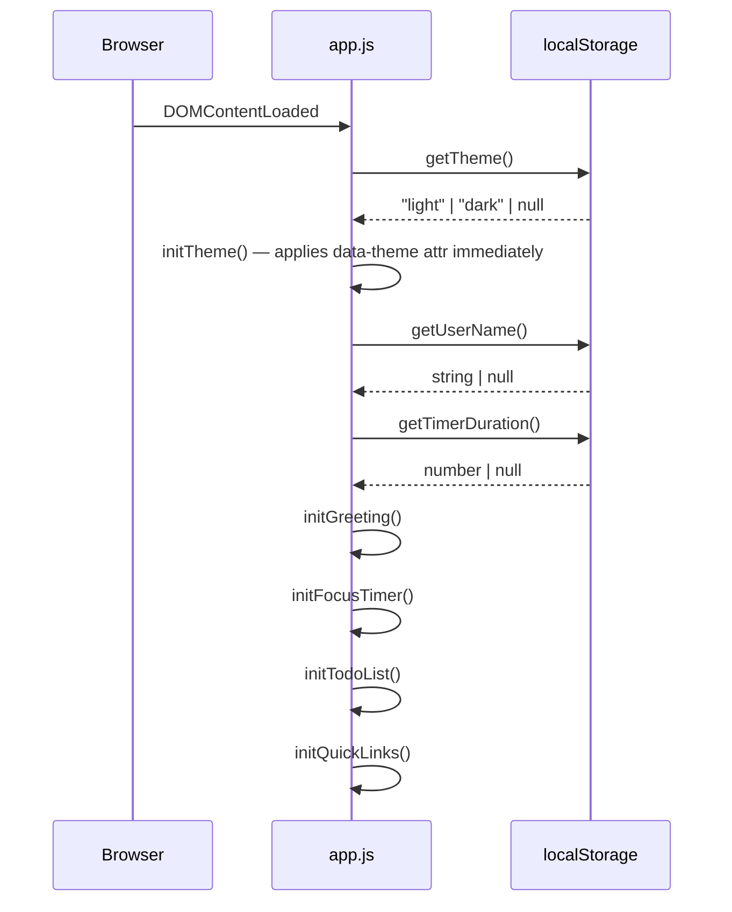

# Design Document: Dashboard Enhancements

## Overview

This document describes the technical design for four enhancements to the existing To-Do Life Dashboard:

1. **Light / Dark mode toggle** — a CSS custom-property–based theming system with `localStorage` persistence.
2. **Custom name in greeting** — an inline name input that personalises the greeting message.
3. **Customisable Pomodoro timer duration** — a duration input that replaces the hard-coded 1500-second default.
4. **Purple primary colour** — a one-line token change in `css/style.css`.

All enhancements are purely client-side. The delivery remains three files:

- `index.html` — markup additions (toggle button, name input, duration input)
- `css/style.css` — new CSS custom properties for dark theme and updated colour tokens
- `js/app.js` — new init/load/save helpers and modifications to existing widget functions

No build tools, frameworks, or backend are introduced. All preferences are persisted to `localStorage`.

---

## Architecture

The existing **module-per-widget** pattern is preserved. Each enhancement is either a small addition to an existing `init*()` function or a new standalone helper. A new top-level `initTheme()` function is added and called first in the `DOMContentLoaded` handler so the theme is applied before any widget renders.

```
index.html
  └── <link> css/style.css
  └── <script> js/app.js
        ├── initTheme()         — Req 1  (NEW)
        ├── initGreeting()      — Req 1, 2  (MODIFIED)
        ├── initFocusTimer()    — Req 3  (MODIFIED)
        ├── initTodoList()      — unchanged
        └── initQuickLinks()    — unchanged
```

### Execution Flow



### Theme Application Strategy

The theme is applied by setting a `data-theme` attribute on `<html>`. CSS custom properties scoped to `[data-theme="dark"]` override the light-mode defaults defined on `:root`. This approach:

- Requires zero JavaScript for re-rendering — a single attribute write triggers the cascade.
- Avoids a flash of the wrong theme because `initTheme()` runs before any widget paint.
- Keeps all colour logic in CSS, not JavaScript.

```mermaid
flowchart LR
    A[DOMContentLoaded] --> B[loadTheme from localStorage]
    B --> C{value?}
    C -- '"dark"' --> D[document.documentElement.setAttribute\ndataset.theme = 'dark']
    C -- '"light"' or null --> E[document.documentElement.setAttribute\ndataset.theme = 'light']
    D --> F[CSS cascade applies dark tokens]
    E --> G[CSS cascade applies light tokens]
```

---

## Components and Interfaces

### 1. Theme Toggle

**DOM addition (inside `<body>`, before the first `<section>`):**
```html
<div id="theme-toggle-bar">
  <button id="btn-theme-toggle" aria-label="Switch to dark mode">
    <span id="theme-icon">☀️</span>
  </button>
</div>
```

**Functions:**
- `loadTheme()` — reads `tdld_theme` from `localStorage`; returns `"light"` if absent or on error.
- `saveTheme(theme)` — writes `theme` to `localStorage` under `tdld_theme`; swallows storage errors.
- `applyTheme(theme)` — sets `document.documentElement.dataset.theme = theme` and updates the toggle button's `aria-label` and icon (☀️ for light, 🌙 for dark).
- `initTheme()` — calls `loadTheme()` then `applyTheme()`, then attaches a click listener to `#btn-theme-toggle` that toggles between `"light"` and `"dark"`, calls `applyTheme()`, and calls `saveTheme()`.

**Toggle logic:**
```
currentTheme = document.documentElement.dataset.theme
newTheme     = currentTheme === "dark" ? "light" : "dark"
applyTheme(newTheme)
saveTheme(newTheme)
```

**Button label / icon mapping:**

| Active theme | `aria-label`           | Icon |
|--------------|------------------------|------|
| `"light"`    | "Switch to dark mode"  | ☀️   |
| `"dark"`     | "Switch to light mode" | 🌙   |

---

### 2. Custom Name in Greeting

**DOM addition (inside `<section id="greeting">`, below `#greeting-message`):**
```html
<div id="name-input-row">
  <input id="name-input" type="text" placeholder="Your name…" aria-label="Enter your name" />
  <button id="btn-set-name">Set</button>
</div>
```

**Functions:**
- `loadUserName()` — reads `tdld_user_name` from `localStorage`; returns `""` if absent or on error.
- `saveUserName(name)` — if `name` is non-empty, writes to `localStorage`; if empty, removes the key. Swallows storage errors.
- `renderGreetingMessage(hour, name)` — returns the greeting string: `"Good Morning, Alex"` if `name` is non-empty, `"Good Morning"` otherwise.
- `initGreeting()` (modified) — additionally loads `userName`, pre-fills `#name-input`, and attaches a click listener to `#btn-set-name` that trims the input value, calls `saveUserName()`, and calls `renderGreeting()`.

**`renderGreeting()` modification:**
```
name = loadUserName()   // or from in-memory variable updated on set
message = getGreeting(hour)
if name is non-empty: message = message + ", " + name
```

The `userName` is kept in a module-scoped variable (initialised from `localStorage` on load) so `renderGreeting()` — which fires every 60 seconds — does not need to re-read `localStorage` on every tick.

---

### 3. Customisable Pomodoro Timer Duration

**DOM addition (inside `<section id="focus-timer">`, below `#timer-notification`):**
```html
<div id="duration-input-row">
  <label for="duration-input">Duration (min):</label>
  <input id="duration-input" type="number" min="1" max="99" value="25"
         aria-label="Timer duration in minutes" />
  <button id="btn-set-duration">Set</button>
</div>
<p id="duration-validation-msg" role="alert"></p>
```

**State change:**
- `remainingSeconds` is no longer hard-coded to `1500`. It is initialised to `loadTimerDuration() * 60`.
- A module-scoped `timerDurationMinutes` variable tracks the current configured duration (default 25).

**Functions:**
- `loadTimerDuration()` — reads `tdld_timer_duration` from `localStorage`; returns `25` if absent, non-numeric, or out of range.
- `saveTimerDuration(minutes)` — writes `minutes` to `localStorage` under `tdld_timer_duration`; swallows storage errors.
- `setTimerDuration(minutes)` — validates that `minutes` is an integer in [1, 99]; if invalid, sets `#duration-validation-msg` and returns early; if valid, clears the message, updates `timerDurationMinutes`, resets `remainingSeconds = minutes * 60`, calls `resetTimer()`, and calls `saveTimerDuration(minutes)`.
- `initFocusTimer()` (modified) — reads `timerDurationMinutes` from `loadTimerDuration()`, sets `remainingSeconds` accordingly, pre-fills `#duration-input`, and attaches a click listener to `#btn-set-duration`.

**Duration input disabled state:**
`#duration-input` and `#btn-set-duration` are disabled while `intervalId !== null` (timer is running). `renderTimer()` is updated to sync this disabled state alongside the existing Start/Stop button logic.

**Validation rules:**

| Condition | Message |
|-----------|---------|
| Empty input | "Please enter a duration." |
| Non-integer (e.g. 2.5) | "Duration must be a whole number." |
| Less than 1 | "Duration must be at least 1 minute." |
| Greater than 99 | "Duration must be at most 99 minutes." |

---

### 4. Purple Primary Colour

This is a pure CSS token change. No JavaScript changes are required.

In `css/style.css`, the `:root` block is updated:

```css
/* Before */
--color-accent:       #4f46e5;
--color-accent-hover: #4338ca;

/* After */
--color-accent:       #7c3aed;
--color-accent-hover: #6d28d9;
```

All existing rules that reference `var(--color-accent)` and `var(--color-accent-hover)` automatically pick up the new values. No selector changes are needed.

**Contrast verification (WCAG 2.1 AA, 4.5:1 minimum):**

| Foreground | Background (light) | Ratio | Pass? |
|---|---|---|---|
| `#7c3aed` on `#ffffff` | white surface | ~5.9:1 | ✓ |
| `#ffffff` on `#7c3aed` | purple button | ~5.9:1 | ✓ |
| `#7c3aed` on `#f5f5f5` | light page bg | ~5.7:1 | ✓ |

Dark theme purple-tinted surface (`#2d1f4e`) with light text (`#e5e7eb`):

| Foreground | Background (dark) | Ratio | Pass? |
|---|---|---|---|
| `#e5e7eb` on `#1a1a2e` | dark page bg | ~13:1 | ✓ |
| `#c4b5fd` on `#2d1f4e` | dark surface | ~6.2:1 | ✓ |

---

## Data Models

### Theme Preference

```js
// localStorage key: "tdld_theme"
// Value: "light" | "dark"
// Default: "light"
"light"
```

### User Name

```js
// localStorage key: "tdld_user_name"
// Value: non-empty trimmed string, or key absent
// Default: "" (key absent → no name shown)
"Alex"
```

### Timer Duration

```js
// localStorage key: "tdld_timer_duration"
// Value: integer string in range [1, 99]
// Default: 25 (key absent → 25 minutes)
"25"
```

### CSS Custom Properties — Dark Theme Additions

The following new tokens are added to `css/style.css`:

```css
:root {
  /* existing light-mode tokens remain unchanged */
  --color-bg:        #f5f5f5;
  --color-surface:   #ffffff;
  --color-border:    #e0e0e0;
  --color-text:      #1a1a1a;
  --color-text-muted:#6b7280;
  --color-accent:    #7c3aed;   /* updated: purple */
  --color-accent-hover: #6d28d9; /* updated: purple hover */
  --color-danger:    #dc2626;
  --color-danger-hover: #b91c1c;
}

[data-theme="dark"] {
  --color-bg:        #1a1a2e;
  --color-surface:   #2d1f4e;
  --color-border:    #4a3f6b;
  --color-text:      #e5e7eb;
  --color-text-muted:#9ca3af;
  --color-accent:    #c4b5fd;   /* lighter purple for dark bg contrast */
  --color-accent-hover: #a78bfa;
  --color-danger:    #f87171;
  --color-danger-hover: #ef4444;
}
```

### localStorage Key Summary

| Key | Type | Default | Owner |
|-----|------|---------|-------|
| `tdld_tasks` | JSON array | `[]` | To-Do List (existing) |
| `tdld_links` | JSON array | `[]` | Quick Links (existing) |
| `tdld_theme` | `"light"` \| `"dark"` | `"light"` | Theme Toggle (new) |
| `tdld_user_name` | string | `""` (key absent) | Greeting Widget (new) |
| `tdld_timer_duration` | integer string | `"25"` | Focus Timer (new) |

---

## Correctness Properties

*A property is a characteristic or behavior that should hold true across all valid executions of a system — essentially, a formal statement about what the system should do. Properties serve as the bridge between human-readable specifications and machine-verifiable correctness guarantees.*

### Property 1: Theme toggle is an involution

*For any* theme value (`"light"` or `"dark"`), toggling the theme twice SHALL return the active theme to its original value.

**Validates: Requirements 1.2**

---

### Property 2: Theme persistence round-trip

*For any* theme value (`"light"` or `"dark"`), calling `saveTheme(theme)` followed by `loadTheme()` SHALL return the same theme value.

**Validates: Requirements 1.5**

---

### Property 3: Theme icon and label reflect active theme

*For any* theme value, after calling `applyTheme(theme)`, the toggle button's `aria-label` SHALL indicate switching to the opposite theme, and the icon SHALL display the symbol associated with the current theme (☀️ for light, 🌙 for dark).

**Validates: Requirements 1.8**

---

### Property 4: Greeting message includes trimmed name

*For any* non-empty string (after trimming) used as a user name, and *for any* hour in [0, 23], `renderGreetingMessage(hour, name.trim())` SHALL return a string that contains both the appropriate time-of-day greeting and the trimmed name, separated by a comma and space.

**Validates: Requirements 2.2, 2.7**

---

### Property 5: User name persistence round-trip

*For any* non-empty trimmed string used as a user name, calling `saveUserName(name)` followed by `loadUserName()` SHALL return the same name string.

**Validates: Requirements 2.3**

---

### Property 6: Timer duration validation accepts valid range and rejects invalid input

*For any* integer in [1, 99], `setTimerDuration(value)` SHALL accept the input (no validation message, `remainingSeconds` updated). *For any* value that is not a whole number, is less than 1, or is greater than 99, `setTimerDuration(value)` SHALL reject the input and set a non-empty validation message, leaving `remainingSeconds` unchanged.

**Validates: Requirements 3.2, 3.7**

---

### Property 7: Setting duration resets countdown to correct value

*For any* valid integer duration D in [1, 99], after calling `setTimerDuration(D)`, `remainingSeconds` SHALL equal `D * 60`.

**Validates: Requirements 3.3**

---

### Property 8: Timer duration persistence round-trip

*For any* valid integer duration D in [1, 99], calling `saveTimerDuration(D)` followed by `loadTimerDuration()` SHALL return D.

**Validates: Requirements 3.4**

---

### Property 9: Duration input disabled state matches timer running state

*For any* timer state, the `#duration-input` element and `#btn-set-duration` button SHALL be disabled if and only if the timer is currently running (`intervalId !== null`).

**Validates: Requirements 3.8**

---

### Property 10: Missing preference keys produce correct defaults

*For any* combination of the three preference keys (`tdld_theme`, `tdld_user_name`, `tdld_timer_duration`) being absent from `localStorage`, calling the corresponding load function SHALL return the correct default value (`"light"`, `""`, and `25` respectively) without throwing an error.

**Validates: Requirements 5.3**

---

## Error Handling

### localStorage Unavailability

All `localStorage` read/write operations for the new preferences (`tdld_theme`, `tdld_user_name`, `tdld_timer_duration`) are wrapped in `try/catch`, consistent with the existing pattern for `tdld_tasks` and `tdld_links`. On read failure, the default value is returned. On write failure, the in-memory state is still updated so the preference takes effect for the current session.

### Corrupt or Unexpected localStorage Values

- **Theme**: If the stored value is neither `"light"` nor `"dark"`, `loadTheme()` returns `"light"`.
- **User name**: If the stored value is present but empty after trimming, it is treated as absent (no name shown).
- **Timer duration**: If the stored value is non-numeric, out of range, or non-integer, `loadTimerDuration()` returns `25`.

### Duration Input Validation

Validation errors are shown inline in `#duration-validation-msg` (which has `role="alert"` for screen reader announcement). The message is cleared when the user submits a valid duration or modifies the input field.

### Theme Flash Prevention

`initTheme()` is called as the very first statement in the `DOMContentLoaded` handler, before any widget initialisation. This minimises the window between page parse and theme application. For further flash prevention, an inline `<script>` in `<head>` (before `<link rel="stylesheet">`) could apply the `data-theme` attribute synchronously — this is noted as an optional enhancement but not required by the current spec.

### Name Input Edge Cases

- Submitting a name composed entirely of whitespace is treated as clearing the name (equivalent to an empty submission). The `tdld_user_name` key is removed from `localStorage`.
- The 60-second greeting refresh interval reads the in-memory `userName` variable, not `localStorage`, so a storage failure after initial load does not affect the running greeting.

---

## Testing Strategy

### PBT Applicability Assessment

This feature is suitable for property-based testing. The enhancements include pure functions (`renderGreetingMessage`, `loadTheme`, `saveTheme`, `loadTimerDuration`, `saveTimerDuration`, `setTimerDuration`) with clear input/output behaviour and universal properties that hold across a wide input space (all valid theme values, all valid name strings, all valid duration integers). The recommended PBT library is **fast-check** (JavaScript).

### Unit Tests (Example-Based)

Focus on specific scenarios and edge cases:

- `loadTheme()` with key absent → `"light"`
- `loadTheme()` with `"dark"` stored → `"dark"`
- `loadTheme()` with corrupt value (e.g. `"blue"`) → `"light"`
- `applyTheme("dark")` → `document.documentElement.dataset.theme === "dark"`, icon is 🌙
- `applyTheme("light")` → icon is ☀️, aria-label is "Switch to dark mode"
- `loadUserName()` with key absent → `""`
- `saveUserName("")` → key removed from localStorage
- `renderGreetingMessage(9, "")` → `"Good Morning"` (no comma)
- `renderGreetingMessage(9, "Alex")` → `"Good Morning, Alex"`
- `loadTimerDuration()` with key absent → `25`
- `loadTimerDuration()` with `"0"` stored → `25` (out of range)
- `loadTimerDuration()` with `"2.5"` stored → `25` (non-integer)
- `setTimerDuration(0)` → rejected, validation message shown
- `setTimerDuration(100)` → rejected, validation message shown
- `setTimerDuration(25)` → `remainingSeconds === 1500`
- `setTimerDuration(1)` → `remainingSeconds === 60`
- `setTimerDuration(99)` → `remainingSeconds === 5940`
- Duration input disabled while timer running, enabled while stopped
- All three defaults applied when all three keys absent from localStorage

### Property-Based Tests

Using **fast-check**. Each test runs a minimum of **100 iterations**.

Tag format: `Feature: dashboard-enhancements, Property {N}: {property_text}`

| Property | Description | Generator inputs |
|----------|-------------|-----------------|
| P1 | Theme toggle is an involution | `fc.constantFrom("light", "dark")` |
| P2 | Theme persistence round-trip | `fc.constantFrom("light", "dark")` |
| P3 | Theme icon and label reflect active theme | `fc.constantFrom("light", "dark")` |
| P4 | Greeting message includes trimmed name | `fc.string({ minLength: 1 }).filter(s => s.trim().length > 0)`, `fc.integer({ min: 0, max: 23 })` |
| P5 | User name persistence round-trip | `fc.string({ minLength: 1 }).filter(s => s.trim().length > 0)` |
| P6 | Duration validation accepts [1,99], rejects others | `fc.integer({ min: 1, max: 99 })` for valid; `fc.oneof(fc.integer({ max: 0 }), fc.integer({ min: 100 }), fc.float().filter(n => !Number.isInteger(n)))` for invalid |
| P7 | Setting duration resets countdown correctly | `fc.integer({ min: 1, max: 99 })` |
| P8 | Duration persistence round-trip | `fc.integer({ min: 1, max: 99 })` |
| P9 | Duration input disabled iff timer running | Timer state (running / stopped) |
| P10 | Missing preference keys produce correct defaults | `fc.subarray(["tdld_theme", "tdld_user_name", "tdld_timer_duration"])` |

### Integration / Smoke Tests

Manual verification checklist:

- [ ] Page loads with dark theme applied immediately (no flash) when `tdld_theme = "dark"` is pre-set in localStorage
- [ ] Theme toggle button is visible and keyboard-accessible from all scroll positions
- [ ] Greeting shows "Good Morning, [Name]" after setting a name and reloading
- [ ] Timer initialises to stored duration after reload
- [ ] Duration input is disabled while timer is counting down
- [ ] All three preferences survive a full page reload
- [ ] Page functions correctly in private browsing mode (localStorage unavailable)
- [ ] Purple accent colour (`#7c3aed`) is visible on buttons, focus rings, checkboxes, and link text
- [ ] Dark theme applies purple-tinted surfaces to all four sections
- [ ] No horizontal scrollbar at 320px viewport width with all enhancements active
- [ ] No console errors on load in Chrome, Firefox, Edge, Safari
