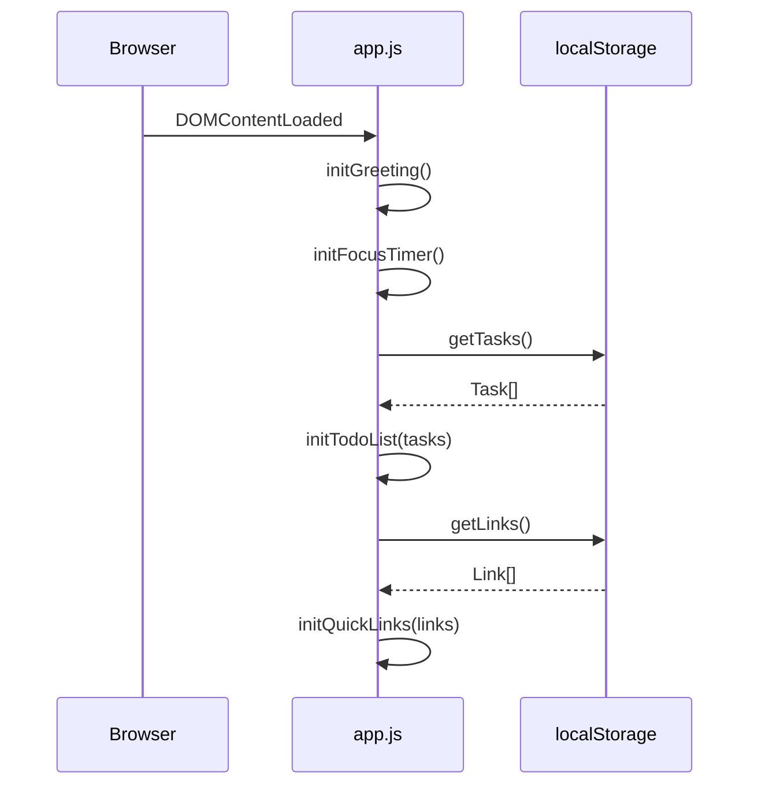

# Design Document: To-Do Life Dashboard

## Overview

The To-Do Life Dashboard is a single-page web application built with plain HTML, CSS, and Vanilla JavaScript. It requires no build tools, no frameworks, and no backend. All state is persisted to the browser's `localStorage`. The application is delivered as three files:

- `index.html` — markup and structure
- `css/style.css` — all styling
- `js/app.js` — all behaviour

The page is divided into four independent widget sections that initialise on `DOMContentLoaded` and operate without inter-widget dependencies. Each widget owns its own slice of `localStorage`.

---

## Architecture

The application follows a simple **module-per-widget** pattern inside a single `app.js` file. Each widget is an immediately-invoked or explicitly-called initialisation function. There is no global mutable state shared between widgets; each widget reads and writes only its own `localStorage` key.

```
index.html
  └── <link> css/style.css
  └── <script> js/app.js
        ├── initGreeting()      — Req 1
        ├── initFocusTimer()    — Req 2
        ├── initTodoList()      — Req 3, 4, 5
        └── initQuickLinks()    — Req 6, 7
```

### Execution Flow



### Timer Tick Model

The Focus Timer uses `setInterval` with a 1-second interval. A single `intervalId` variable tracks the active interval; `null` means the timer is stopped. The remaining seconds are stored in a module-level variable, not in the DOM.

### Greeting Update Model

A `setInterval` fires every 60 seconds to refresh the time display. On each tick the current `Date` is read and the DOM is updated in place.

---

## Components and Interfaces

### 1. Greeting Widget

**DOM structure:**
```
<section id="greeting">
  <p id="greeting-time">HH:MM</p>
  <p id="greeting-date">Weekday, DD Month YYYY</p>
  <p id="greeting-message">Good Morning</p>
</section>
```

**Functions:**
- `initGreeting()` — renders immediately, then schedules a 60-second interval
- `renderGreeting()` — reads `new Date()`, formats time/date/message, writes to DOM

**Greeting logic:**

| Hour range (local) | Message        |
|--------------------|----------------|
| 05 – 11            | Good Morning   |
| 12 – 17            | Good Afternoon |
| 18 – 21            | Good Evening   |
| 22 – 04            | Good Night     |

---

### 2. Focus Timer

**DOM structure:**
```
<section id="focus-timer">
  <p id="timer-display">25:00</p>
  <button id="btn-start">Start</button>
  <button id="btn-stop">Stop</button>
  <button id="btn-reset">Reset</button>
  <p id="timer-notification" aria-live="polite"></p>
</section>
```

**State variables (module-scoped):**
- `remainingSeconds: number` — initialised to 1500 (25 × 60)
- `intervalId: number | null` — `null` when stopped

**Functions:**
- `initFocusTimer()` — attaches event listeners, renders initial state
- `renderTimer()` — formats `remainingSeconds` as MM:SS, updates display, syncs button disabled states
- `startTimer()` — guards against double-start, creates interval
- `stopTimer()` — clears interval, sets `intervalId = null`
- `resetTimer()` — calls `stopTimer()`, resets `remainingSeconds` to 1500, clears notification
- `onTick()` — decrements `remainingSeconds`; if 0, calls `stopTimer()` and fires notification

**Button disabled rules:**

| State    | Start disabled | Stop disabled |
|----------|---------------|---------------|
| Running  | ✓             |               |
| Paused   |               | ✓             |
| Reset    |               | ✓             |

**Notification:** Sets `timer-notification` text content to "Time's up!" and uses the [Web Notifications API](https://developer.mozilla.org/en-US/docs/Web/API/Notifications_API) if permission is granted (graceful fallback to visual-only if denied or unsupported).

---

### 3. To-Do List

**DOM structure:**
```
<section id="todo-list">
  <div id="todo-input-row">
    <input id="todo-input" type="text" placeholder="New task…" />
    <button id="btn-add-task">Add</button>
  </div>
  <ul id="task-list">
    <!-- per task: -->
    <li data-id="{id}">
      <input type="checkbox" />
      <span class="task-title"></span>
      <button class="btn-edit">Edit</button>
      <button class="btn-delete">Delete</button>
    </li>
  </ul>
</section>
```

**Functions:**
- `initTodoList()` — loads from `localStorage`, renders list, attaches input listeners
- `addTask(title)` — validates (non-empty after trim), creates Task object, appends to array, persists, renders
- `renderTaskList()` — clears `<ul>`, re-renders all tasks from in-memory array
- `renderTask(task)` — creates `<li>` with checkbox, title span, edit and delete buttons
- `toggleTask(id)` — flips `completed`, persists, re-renders
- `startEditTask(id)` — replaces title span with `<input>` pre-filled with current title
- `confirmEditTask(id, newTitle)` — validates; if valid updates title, else restores original; persists, re-renders
- `deleteTask(id)` — removes from array, persists, re-renders
- `saveTasks()` — serialises task array to `localStorage` under key `tdld_tasks`
- `loadTasks()` — deserialises from `localStorage`; returns `[]` on missing/corrupt data

**Task ID:** `crypto.randomUUID()` (available in all target browsers); falls back to `Date.now().toString(36) + Math.random().toString(36)` if unavailable.

---

### 4. Quick Links

**DOM structure:**
```
<section id="quick-links">
  <div id="link-input-row">
    <input id="link-label-input" type="text" placeholder="Label" />
    <input id="link-url-input" type="url" placeholder="https://…" />
    <button id="btn-add-link">Add</button>
  </div>
  <p id="link-validation-msg" role="alert"></p>
  <div id="link-buttons">
    <!-- per link: -->
    <span class="link-item">
      <a href="{url}" target="_blank" rel="noopener noreferrer">{label}</a>
      <button class="btn-delete-link">×</button>
    </span>
  </div>
</section>
```

**Functions:**
- `initQuickLinks()` — loads from `localStorage`, renders buttons, attaches input listeners
- `addLink(label, url)` — validates both fields non-empty; shows inline message on failure; creates Link, persists, renders
- `renderLinks()` — clears `#link-buttons`, re-renders all links
- `deleteLink(id)` — removes from array, persists, re-renders
- `saveLinks()` — serialises link array to `localStorage` under key `tdld_links`
- `loadLinks()` — deserialises from `localStorage`; returns `[]` on missing/corrupt data

**Validation message:** Cleared on next successful add or when the user starts typing again.

---

## Data Models

### Task

```js
{
  id: string,          // unique identifier (UUID or fallback)
  title: string,       // non-empty, trimmed
  completed: boolean   // false on creation
}
```

**localStorage key:** `tdld_tasks`
**Format:** JSON array of Task objects, e.g. `[{"id":"…","title":"Buy milk","completed":false}]`

### Link

```js
{
  id: string,   // unique identifier
  label: string, // non-empty, trimmed display text
  url: string    // non-empty URL string as entered by user
}
```

**localStorage key:** `tdld_links`
**Format:** JSON array of Link objects

### Timer State

The timer state is **not persisted** to `localStorage`. It resets to 25:00 on every page load. This is intentional — a Pomodoro timer is a session-scoped tool.

### Greeting State

No persistent state. The greeting is derived from `new Date()` on every render tick.

---
## Correctness Properties

*A property is a characteristic or behavior that should hold true across all valid executions of a system — essentially, a formal statement about what the system should do. Properties serve as the bridge between human-readable specifications and machine-verifiable correctness guarantees.*

### Property 1: Time format correctness

*For any* `Date` object, `formatTime(date)` SHALL return a string matching the pattern `HH:MM` where HH is the zero-padded 24-hour hour and MM is the zero-padded minute.

**Validates: Requirements 1.1**

---

### Property 2: Date format correctness

*For any* `Date` object, `formatDate(date)` SHALL return a string that contains a full weekday name, a numeric day, a full month name, and a 4-digit year.

**Validates: Requirements 1.2**

---

### Property 3: Greeting correctness for all hours

*For any* integer hour in [0, 23], `getGreeting(hour)` SHALL return exactly one of "Good Morning", "Good Afternoon", "Good Evening", or "Good Night" according to the defined time-of-day partitions (05–11 → Morning, 12–17 → Afternoon, 18–21 → Evening, 22–04 → Night).

**Validates: Requirements 1.3, 1.4, 1.5, 1.6**

---

### Property 4: Timer display format correctness

*For any* integer `remainingSeconds` in [0, 1500], `formatTimer(remainingSeconds)` SHALL return a string matching `MM:SS` where MM and SS are zero-padded and the total seconds represented equals `remainingSeconds`.

**Validates: Requirements 2.3**

---

### Property 5: Timer countdown decrements correctly

*For any* integer N in [1, 1499], after starting the timer and advancing N ticks, `remainingSeconds` SHALL equal `1500 - N`.

**Validates: Requirements 2.2**

---

### Property 6: Timer stop preserves remaining time

*For any* timer state where the timer has been started and advanced by some number of ticks, stopping the timer SHALL leave `remainingSeconds` unchanged from its value at the moment of stopping.

**Validates: Requirements 2.4**

---

### Property 7: Timer button state invariant

*For any* timer state (running, paused, or reset), the Start button SHALL be disabled if and only if the timer is running, and the Stop button SHALL be disabled if and only if the timer is paused or reset.

**Validates: Requirements 2.7, 2.8**

---

### Property 8: Task addition grows the list

*For any* non-empty (after trim) task title string, calling `addTask(title)` on a task list of length N SHALL result in a task list of length N + 1 containing a task with that trimmed title.

**Validates: Requirements 3.2**

---

### Property 9: Whitespace task rejection

*For any* string composed entirely of whitespace characters (spaces, tabs, newlines), calling `addTask(title)` SHALL not add any task and the task list length SHALL remain unchanged.

**Validates: Requirements 3.3**

---

### Property 10: Task creation persistence round-trip

*For any* non-empty task title, after calling `addTask(title)` and then `loadTasks()`, the returned array SHALL contain a task with that title and `completed: false`.

**Validates: Requirements 3.4**

---

### Property 11: Task toggle idempotence pair

*For any* task with any initial `completed` state, toggling the task twice SHALL return the task to its original `completed` state.

**Validates: Requirements 4.1**

---

### Property 12: Edit with valid title updates task

*For any* task and any non-empty (after trim) new title string, calling `confirmEditTask(id, newTitle)` SHALL update the task's title to the trimmed new title.

**Validates: Requirements 4.3**

---

### Property 13: Edit with whitespace-only title restores original

*For any* task with a non-empty title and any whitespace-only edit input, calling `confirmEditTask(id, whitespaceInput)` SHALL leave the task's title unchanged.

**Validates: Requirements 4.4**

---

### Property 14: Task deletion removes only the target

*For any* task list of length N ≥ 1 and any task in that list, calling `deleteTask(id)` SHALL result in a list of length N − 1 that contains all original tasks except the deleted one.

**Validates: Requirements 4.5**

---

### Property 15: Task persistence round-trip on load

*For any* array of Task objects saved to `localStorage` under `tdld_tasks`, calling `loadTasks()` SHALL return an array equal in length and content (id, title, completed) to the saved array.

**Validates: Requirements 5.1, 5.2**

---

### Property 16: Link addition grows the list

*For any* non-empty label string and non-empty URL string, calling `addLink(label, url)` on a link list of length N SHALL result in a link list of length N + 1 containing a link with that label and URL.

**Validates: Requirements 6.2**

---

### Property 17: Invalid link input rejected with validation message

*For any* input where the label is empty/whitespace, the URL is empty/whitespace, or both are empty/whitespace, calling `addLink(label, url)` SHALL not add any link, the link list length SHALL remain unchanged, and a non-empty validation message SHALL be displayed.

**Validates: Requirements 6.3**

---

### Property 18: Link renders with correct href and target

*For any* Link object with a given URL, the rendered anchor element SHALL have `href` equal to the link's URL and `target` equal to `"_blank"`.

**Validates: Requirements 6.4**

---

### Property 19: Link deletion removes only the target

*For any* link list of length N ≥ 1 and any link in that list, calling `deleteLink(id)` SHALL result in a list of length N − 1 that contains all original links except the deleted one.

**Validates: Requirements 6.5**

---

### Property 20: Link persistence round-trip on load

*For any* array of Link objects saved to `localStorage` under `tdld_links`, calling `loadLinks()` SHALL return an array equal in length and content (id, label, url) to the saved array.

**Validates: Requirements 7.1, 7.2**

---

## Error Handling

### localStorage Unavailability

`localStorage` may be unavailable (private browsing mode, storage quota exceeded, or security policy). All read/write operations are wrapped in `try/catch`. On read failure, the widget initialises with an empty array and logs a console warning. On write failure, the UI update proceeds but the user is not notified (silent degradation — the data is still visible in the current session).

### Corrupt localStorage Data

`JSON.parse` is wrapped in `try/catch`. If parsing fails, the widget falls back to an empty array, effectively discarding corrupt data. This prevents a blank/broken page.

### Timer Edge Cases

- Double-clicking Start: guarded by checking `intervalId !== null` before creating a new interval.
- Reset while running: `clearInterval` is always called before resetting state, preventing orphaned intervals.

### Quick Links URL Handling

The URL is stored and used as-entered. The `<a>` element's `href` attribute handles navigation. No URL normalisation or protocol injection is performed — the user is responsible for entering a valid URL. The `type="url"` on the input provides browser-native basic validation feedback.

### Edit Confirmation on Blur

When the user clicks away from an inline edit input without pressing Enter, the edit is treated as cancelled and the original title is restored. This prevents accidental data loss.

---

## Testing Strategy

> **Note:** This project has no build tools, no test runner, and no test framework by design (per requirements). The testing strategy below describes what *should* be verified and how, for manual or future automated testing if the project constraints change.

### Unit Tests (Example-Based)

Focus on specific scenarios and edge cases:

- `formatTime(date)` with midnight, noon, single-digit hours/minutes
- `formatDate(date)` with known dates
- `getGreeting(hour)` at boundary hours (5, 12, 18, 22, 0, 4)
- `formatTimer(0)` → "00:00", `formatTimer(1500)` → "25:00", `formatTimer(90)` → "01:30"
- `initFocusTimer()` initial state: display "25:00", Stop disabled
- Timer reaches 00:00: stops, shows notification
- `addTask("")` and `addTask("   ")`: list unchanged
- `loadTasks()` with missing key: returns `[]`
- `loadTasks()` with corrupt JSON: returns `[]`
- `addLink("", "https://example.com")`: rejected, message shown
- `loadLinks()` with missing key: returns `[]`

### Property-Based Tests

Since this project uses no build tools or test frameworks, property-based tests are described here for reference. If a test framework is added, the recommended library is **fast-check** (JavaScript). Each property test should run a minimum of **100 iterations**.

Tag format: `Feature: todo-life-dashboard, Property {N}: {property_text}`

| Property | Description | Generator inputs |
|----------|-------------|-----------------|
| P1 | Time format correctness | Random `Date` objects |
| P2 | Date format correctness | Random `Date` objects |
| P3 | Greeting correctness | Random integer in [0, 23] |
| P4 | Timer display format | Random integer in [0, 1500] |
| P5 | Timer countdown decrements | Random N in [1, 1499] |
| P6 | Timer stop preserves state | Random start + tick count |
| P7 | Button state invariant | Random timer state |
| P8 | Task addition grows list | Random non-empty strings |
| P9 | Whitespace task rejection | Random whitespace strings |
| P10 | Task creation round-trip | Random non-empty strings |
| P11 | Toggle idempotence pair | Random tasks |
| P12 | Edit with valid title | Random task + new title |
| P13 | Edit with whitespace restores | Random task + whitespace input |
| P14 | Task deletion removes target | Random task lists |
| P15 | Task persistence round-trip | Random Task arrays |
| P16 | Link addition grows list | Random (label, url) pairs |
| P17 | Invalid link rejected | Random invalid inputs |
| P18 | Link href and target | Random Link objects |
| P19 | Link deletion removes target | Random link lists |
| P20 | Link persistence round-trip | Random Link arrays |

### Integration / Smoke Tests

Manual verification checklist:

- [ ] Page loads in Chrome, Firefox, Edge, Safari without console errors
- [ ] No horizontal scrollbar at 320px viewport width
- [ ] `css/style.css` and `js/app.js` are the only external resources
- [ ] Body font size ≥ 14px (DevTools computed styles)
- [ ] Greeting updates at the next minute boundary without reload
- [ ] Timer notification appears at 00:00
- [ ] Tasks and links survive a full page reload
- [ ] Page load time < 2 seconds on broadband (DevTools Network tab)
- [ ] UI responds to interactions within 100ms (DevTools Performance tab)
